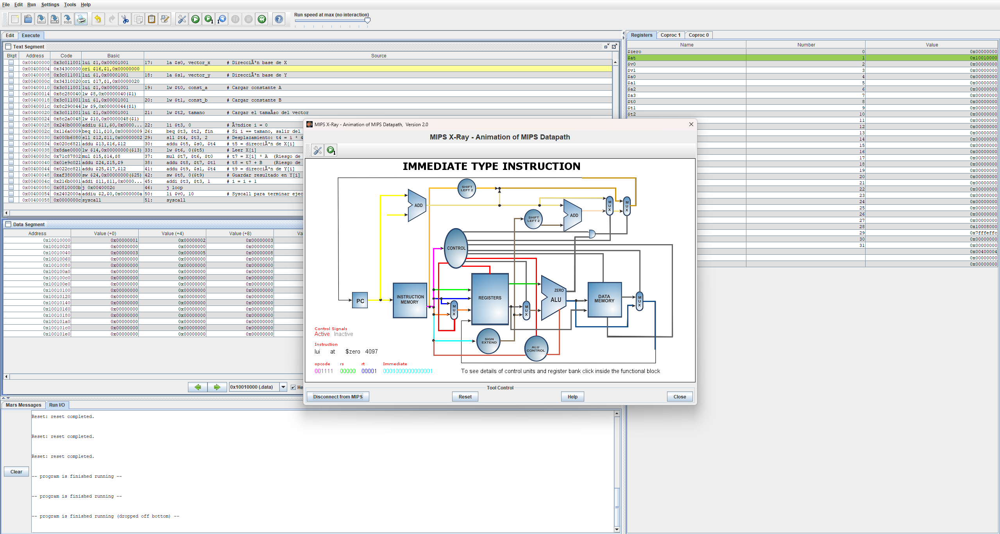
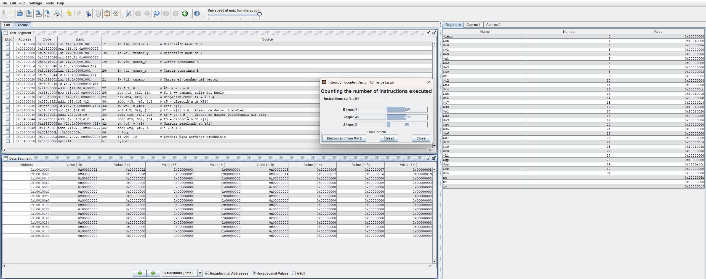
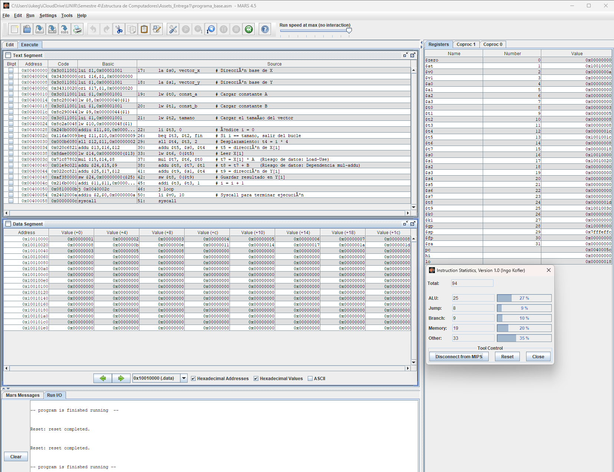
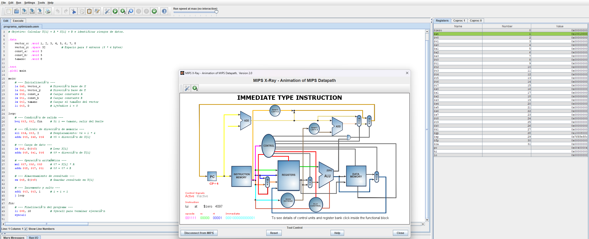
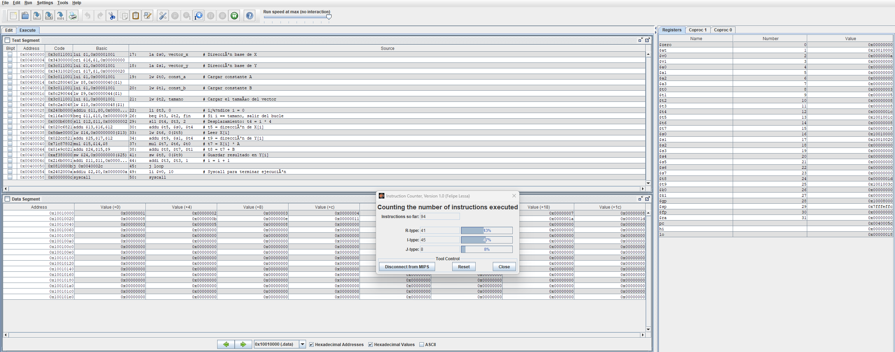
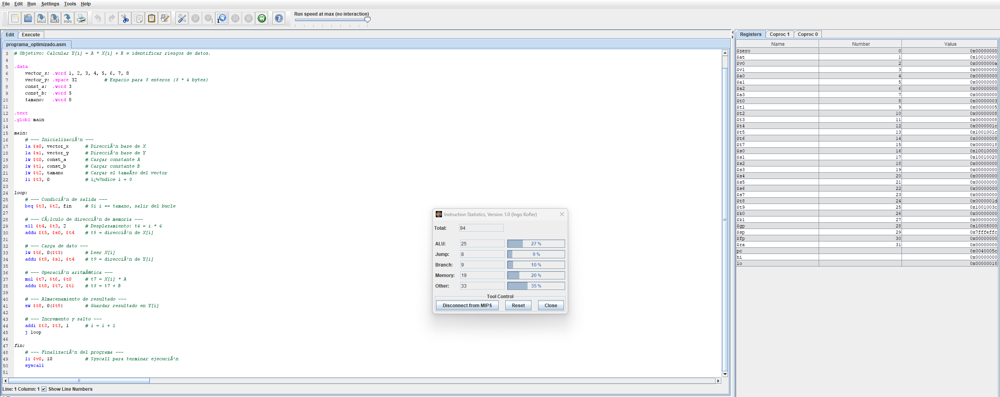

# Informe de Laboratorio: Estructura de Computadores

**Fecha:** [30/08/2026]  
**Nombre del Estudiante:** [Alberto Ruiz Ospina]  
**Asignatura:** [Estructura de Computadores]
**Enlace del repositorio en GitHub:** [https://github.com/N0ST4LG1C/AlbertoRuiz-estructura-computadores-act01.git]

---

## 1. Análisis del Código Base

### 1.1. Evidencia de Ejecución
*   **MIPS X-Ray:** 
*   **Instruction Counter:** 
*   **Instruction Statistics:** 
 


### 1.2. Identificación de Riesgos (Hazards)

| Instrucción Causante | Instrucción Afectada     | Tipo de Riesgo (Load-Use, etc.) | Ciclos de Parada   |
|----------------------|--------------------------|---------------------------------|--------------------|
| `lw $t6, 0($t5)`     | `mul $t7, $t6, $t0`      | Load-Use                        |        1           |
|----------------------|--------------------------|---------------------------------|--------------------|
| `mul $t7, $t6, $t0`  | `addu $t8, $t7, $t1`     | Read after Write (RAW)          |        0           |
|----------------------|--------------------------|---------------------------------|--------------------|
| `addu $t8, $t7, $t1` | `sw $t8, 0($t9)`         | Read after Write (RAW)          |        0           |
|----------------------|--------------------------|---------------------------------|--------------------|
| `addi $t3, $t3, 1`   | `beq $t3, $t2, fin`      | Read after Write (RAW)          |        0           |
|----------------------|--------------------------|---------------------------------|--------------------|
| `beq $t3, $t2, fin`  | Siguientes instrucciones | Control Hazard                  | Depende del modelo |
|----------------------|--------------------------|---------------------------------|--------------------|
| `j loop`             | Siguientes instrucciones | Control Hazard                  | Depende del modelo |
|----------------------|--------------------------|---------------------------------|--------------------|

### 1.2. Estadísticas y Análisis Teórico
Dado que MARS es un simulador funcional, el número de instrucciones ejecutadas fué igual en ambas versiones. Sin embargo, en un procesador real, el tiempo de ejecución (ciclos) varía:

| Métrica                                      | Código Base | Código Optimizado |
|----------------------------------------------|-------------|-------------------|
| Instrucciones Totales (según MARS)           |       94    |          94       |
| Stalls (Paradas) por iteración               |        1    |           0       |
| Total de Stalls (8 iteraciones)              |        8    |           0       |
| **Ciclos Totales Estimados** (Inst + Stalls) |      102    |          94       |
| **CPI Estimado** (Ciclos / Inst)             |    1.085    |       1.000       |

---
> La optimización no reduce el número de instrucciones, sino que mejora el aprovechamiento del pipeline, esto gracias a que no eliminamos instrucciones, sino que cambiamos su orden. 

## 2. Optimización Propuesta

### 2.1. Evidencia de Ejecución (Código Optimizado)
Capturas de pantalla de la ejecución del `programa_optimizado.asm`:
*   **MIPS X-Ray:** 
*   **Instruction Counter:** 
*   **Instruction Statistics:** 

### 2.2. Código Optimizado
Bucle loop optimizado:

```asm
 loop:
    # --- Condición de salida ---
    beq $t3, $t2, fin     # Si i == tamano, salir del bucle
    
    # --- Cálculo de dirección de memoria ---
    sll $t4, $t3, 2       # Desplazamiento: t4 = i * 4
    addu $t5, $s0, $t4    # t5 = dirección de X[i]
    
    # --- Carga de dato ---
    lw $t6, 0($t5)        # Leer X[i]
    addu $t9, $s1, $t4    # t9 = dirección de Y[i] (Instrucción independiente movida al intervalo Load-Use)

    # --- Operación aritmética ---
    mul $t7, $t6, $t0     # t7 = X[i] * A  
    addu $t8, $t7, $t1    # t8 = t7 + B    

    # --- Almacenamiento de resultado ---
    sw $t8, 0($t9)        # Guardar resultado en Y[i]
    
    # --- Incremento y salto ---
    addi $t3, $t3, 1      # i = i + 1
    j loop
```

### 2.2. Justificación Técnica de la Mejora
> Sin reorganizar el código, cuando ´mul´ es la instrucción inmediatamente siguiente a ´lw´, el hazard "load-use" obliga a insertar una burbuja de 1 ciclo. Esto debido a que la etapa EX de 'mul' no puede arrancar en el ciclo 4, porque el dato de '$t6' aún no sale de MEM, por lo que toda la pipeline detrás de 'mul' se retrasa también un ciclo para "esperar ese dato. Una vez reordenado el código, e insertando la instrucción 'addu $t9' que no depende de ´$t6´ justo entre ´lw´ y ´mul´, esa instrucción ocupa exactamente el hueco que antes era la burbuja. Cuando 'mul´ llega a EX en el ciclo 5, el dato de '$t6' ya salió de MEM y se puede reenviar sin parada. Esto hace que, en los mismos 8 ciclos de ejecución ya no caben 3 instrucciones con un hueco, sino 4 instrucciones sin ningún hueco. 

---

## 3. Comparativa de Resultados

| Métrica           | Código Base  | Código Optimizado | Mejora (%) |
|-------------------|--------------|-------------------|------------|
| Ciclos Totales    |     102      |        94         |    7.8%    |
| Stalls (Paradas)  |     08       |        00         |    100%    |
| CPI               |     1.09     |        1.0        |    7.8%    |

---

## 4. Conclusiones
¿Qué impacto tiene la segmentación en el diseño de software de bajo nivel? 

> La segmentación convierte el orden de las instrucciones en una variable de rendimiento, donde dos programas funcionalmente idénticos pueden tener tiempos de ejecución distintos, según cómo se organicen las dependencias entre ellas. Esto te obliga como programador a razonar sobre el hardware subyacente, qué se puede resolver por forwarding y qué requiere esperar. En este caso, mover una única instrucción independiente bastó para eliminar el 100% de las paradas del bucle, sin tocar la lógica del programa, lo que demuestra que muchas optimizaciones de bajo nivel no requieren de más código, pero sí de una mejor organización del mismo.

¿Es siempre posible eliminar todas las paradas?

> No. En este caso funcionó porque existía una instrucción independiente, disponible convenientemente para rellenar el hueco de una carga. Si cada instrucción posterior a un "lw" dependiera realmente del dato cargado y sin ningúna instrucción independiente, no habría nada que mover, y la parada sería inevitable con el hardware utilizado. Para dicho caso, las alternativas requieren ser más agresivas: Loop unrolling, software pipelining entre iteraciones, o reordenar a nivel de compilador. La reordenación de instrucciones reduce las paradas cuando hay independencia disponible, pero no las elimina por diseño en todos los casos.

## Referencias:
1. _Conceptos Básicos del Laboratorio: Arquitecturas
Segmentadas.pdf_
2. _Guía Rápida de Instrucciones MIPS Assembler.pdf_
3. _Tutorial MARS (MIPS Assembler and Runtime
Simulator).pdf_
